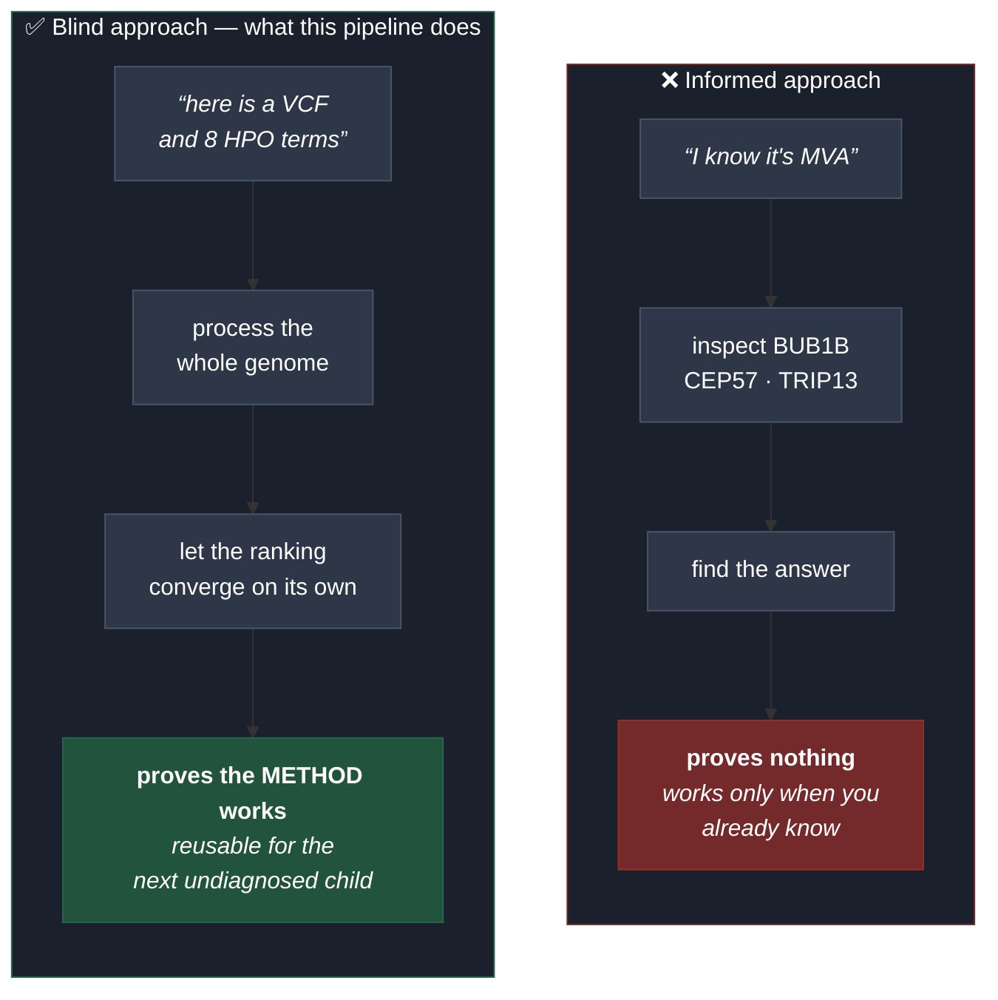
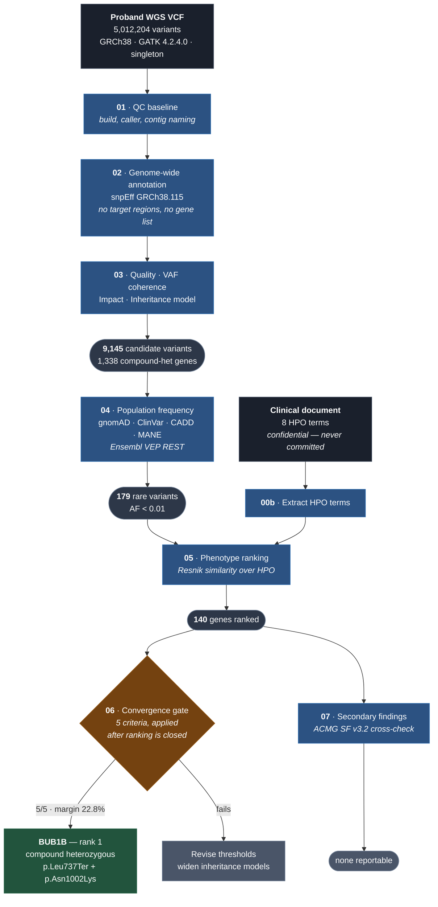
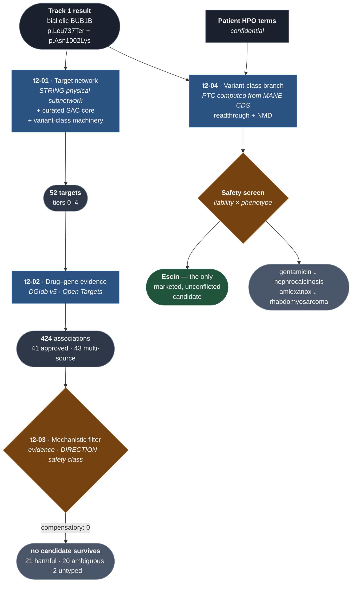

# Rare Disease, Real Kid — MVA Hackathon 2026

A **blind, genome-wide variant triage pipeline** for a real case of Mosaic
Variegated Aneuploidy (MVA), and a drug-repositioning search built on its result.

* **Track 1** — variant prediction. Submitted, scored **100.0 / 100** (F-max 1.000,
  full match at rank 1).
* **Track 2** — from variant and mechanism to candidate medication.

* Challenge: <https://huggingface.co/spaces/SageBio/rare-disease-real-kid-mva-hackathon-2026>
* Dataset (gated): <https://huggingface.co/datasets/SageBio/mva-hackathon-2026-data>
* Submission window: 24 Aug 2026 – 24 Oct 2026 (23:59 UTC) · **max 6 submissions**
* Qualitative evaluation: 24 Oct – 24 Nov 2026

---

## The core design decision: a blind search

The hackathon is named after the disease, and the evaluator's public source code
states the answer key is a *compound-heterozygous* pair. Either fact alone
narrows the problem to three genes and one inheritance model.

**This pipeline deliberately ignores both.**



Stages 01–05 contain **no gene list, no disease name, no inheritance hint**. The
compound-heterozygous expectation is used **only** as a post-hoc validation gate
(stage 06), applied after the ranking is closed.

A method that only works when you already know the answer helps no future
patient — and reusability for other undiagnosed individuals is the stated goal
of this hackathon.

### Result

Starting from **5,012,204 variants**, the blind pipeline ranked **BUB1B first
among 140 candidate genes**, with a **22.8 % margin** over the runner-up and
**5/5 convergence criteria** met. An independent, hypothesis-driven analysis of
the three known MVA genes converged on the **same variant pair**.

---

## Architecture: why the data is not in this folder

Two separate filesystems, on purpose:

| | Location | Contents | Rationale |
|---|---|---|---|
| **Code** | this repository (NTFS) | scripts, docs, reports | version-controlled |
| **Data** | `~/mva/` in WSL (ext4) | VCF, intermediates, heavy outputs | 5–10× faster I/O than `/mnt/c` |

There is a second reason. If the VCF lived inside this repository, a careless
`git add .` would publish a child's genome. The file **not being here** is
defence in depth; `.gitignore` is the second line, not the first.

### Reaching the data from Windows

1. **`results/`** — lightweight reports are mirrored here by
   `pipeline/sync_results.sh`, so they open like any project file
2. **UNC path** — paste into Explorer or open as a folder in VS Code:

   ```
   \\wsl.localhost\Ubuntu-24.04\home\user\mva
   ```

   Pin it to Explorer's Quick Access once and it stays one click away. A `.lnk`
   shortcut is not used: `WScript.Shell` normalises `\\wsl.localhost\...` into a
   broken `C:\wsl.localhost\...` target, and a machine-specific shortcut does
   not belong in a shared repository anyway.

---

## Pipeline



**Blind stages: 01 → 05.** No gene list, no disease name, no inheritance hint.
Stage 06 applies the compound-heterozygous expectation **only after** the
ranking is final.

| Script | Purpose |
|---|---|
| `00_config.sh` | shared paths, thresholds, constants |
| `00b_extract_phenotype.py` | HPO terms from the confidential `.docx` (never committed) |
| `01_qc_baseline.sh` | characterise the raw VCF before filtering anything |
| `02a_download_snpeff_db.sh` | resumable snpEff database download |
| `02_annotate_genomewide.sh` | genome-wide functional annotation (blind) |
| `03_inheritance_models.py` | quality, VAF coherence, impact, inheritance model |
| `04_frequency_clinical.py` | gnomAD / ClinVar / CADD via Ensembl VEP REST |
| `04b_seed_cache.py` | recover annotations from a previous run after batch failures |
| `05_phenotype_rank.py` | HPO semantic-similarity ranking |
| `06_validate_convergence.py` | post-ranking validation gate |
| `07_secondary_findings.py` | ACMG SF v3.2 secondary-findings cross-check |
| `08_mosaic_aneuploidy.py` | mosaic aneuploidy screen from B-allele fractions |
| `09_make_submission.py` | submission CSV, generated automatically |
| `selfcheck.sh` | preflight: tools, versions, inputs, network, repository hygiene |
| `run_all.sh` · `status.sh` · `sync_results.sh` · `99_data_inventory.sh` | orchestration and auditing |

Full stage-by-stage rationale: [docs/01_pipeline_flow.md](docs/01_pipeline_flow.md)

---

## Track 2 — from mechanism to medication

Track 1 ends at a gene. Track 2 asks the next question: **is there anything we
could actually give this child?** Same discipline — numbered stages, every
discard counted, evidence tables committed so the negative is auditable rather
than asserted.



### The result, stated honestly

**No approved drug survives the mechanistic filter.** That is the finding, and
its *shape* is the interesting part:

| | |
|---|---:|
| Drug–gene associations retrieved | 424 |
| Involving an approved drug | 41 — **all single-source** |
| Backed by ≥ 2 distinct sources | 43 — **none approved** |
| Of those 43, acting in the **compensatory** direction | **0** |
| Network targets with no reported drug at all | 38 of 52 |

The 43 well-evidenced associations collapse onto four genes — AURKB, CDK1, PLK1,
TTK — and 41 of them are explicitly typed `inhibitor`. The pharmacology for this
pathway is not missing. It is well developed and aimed in **exactly the direction
that would harm this patient**, because oncology develops checkpoint inhibitors
precisely to force missegregation and kill dividing cells — which is this disease,
deliberately induced.

The proposal therefore comes from the **variant class**, not the gene: one allele
is a premature termination codon, which is addressable at the ribosome. After a
safety screen against the child's own HPO terms, exactly one candidate is both
marketed and unconflicted — **escin**. Expected effect size is small, and the
report says so in its first section rather than its last.

### Is the negative real? A positive control

A zero means nothing unless the pipeline can produce a one. The same gate, run
against loss-of-function diseases that *do* have an approved drug on the
deficient product:

| Control | Survives | |
|---|---:|---|
| **CFTR** — cystic fibrosis | **5** | tezacaftor, elexacaftor, deutivacaftor, vanzacaftor, ivacaftor |
| **PAH** — phenylketonuria | **2** | sapropterin |
| **GBA1** — Gaucher type 1 | 0 | imiglucerase absent from DGIdb (biologics gap) |
| *AURKB* — **negative control** | **0** | 91 associations, correctly rejected |

Two of three pass and the negative control rejects, so **BUB1B's zero is a
statement about BUB1B, not about the filters**. Ivacaftor is admitted on its own
annotation, with the pipeline never told what cystic fibrosis is.

### Signature-based repurposing: the standard alternative also fails

When no target is druggable, the field reaches for Connectivity Map — find
compounds whose transcriptional signature *reverses* the disease signature. It
was run (`t2_06`) against the LINCS L1000 CRISPR knockout consensus for *BUB1B*,
with the eight independent shRNA cell lines as a reproducibility check and
*BUB1B*'s presence in its own DOWN set as an internal control.

**The signature turns out to be largely the cell's defence, not the lesion.** Its
UP half carries 18 type-I interferon genes and 5 p53 targets — exactly what
missegregation should produce, since micronuclei activate cGAS–STING. Reversing
that means suppressing it:

| Liability | Hits | |
|---|---:|---|
| Antiproliferative | 178 | kinase, HDAC, HSP90, topoisomerase, tubulin, cardiac glycosides |
| Immunosuppressive | 16 | corticosteroids, cyclosporine, NF-κB inhibitors |
| **Contraindicated** | **194 of 382 (51 %)** | 49 % unclassified — so 51 % is a **lower bound** |

**Vincristine is among the hits** — a spindle poison already in this child's
rhabdomyosarcoma protocol, returned as a therapy for his spindle defect. Nothing
demonstrates more plainly that signature reversal cannot be read as a
recommendation without a direction-of-effect argument.

Three independent directions now converge, failing for **different** reasons:

```
 t2_03  drug-target databases   ->  0 compensatory; all well-evidenced drugs are inhibitors
 t2_04  variant class, ribosome ->  1 proposable candidate, small expected effect
 t2_06  signature reversal      ->  51% of hits contraindicated by class; 0 helpful
```

### Two components worth reusing

* **Direction filter** — drops inhibitors that would worsen a loss-of-function
  disease. Here it removes all 43 best-evidenced associations, a failure mode
  naive repurposing walks straight into.
* **Phenotype screen** — matches candidate liabilities against the patient's HPO
  terms and *reorders* the ranking. It changed the answer twice: gentamicin has
  the best readthrough evidence and is nephrotoxic in a child with
  nephrocalcinosis; amlexanox is the best mechanistic fit and immunosuppressive
  in a child with an active cancer predisposition.

| Script | Purpose |
|---|---|
| `track2/t2_01_target_network.py` | mechanistic neighbourhood, 5 tiers, physical interactions only |
| `track2/t2_02_drug_evidence.py` | drug–gene evidence across the network (DGIdb v5, Open Targets) |
| `track2/t2_03_mechanism_filter.py` | evidence gate, direction of effect, safety class |
| `track2/t2_04_readthrough_branch.py` | PTC context from the MANE CDS + HPO safety screen |
| `track2/t2_05_positive_control.py` | does the gate admit a real drug when one exists? |
| `track2/t2_06_signature_repurposing.py` | LINCS / Connectivity Map signature reversal |

Evidence tables: [results/track2_evidence/](results/track2_evidence/) — committed
so the negative can be audited.
Full report: [submissions/bralewild_track2_report.md](submissions/bralewild_track2_report.md)

Runs in **under two minutes at zero cost** — one STRING call, three batched DGIdb
calls, one Open Targets, one Ensembl.

---

## Running it

This is a plain Linux pipeline. Nothing is tied to a particular machine: the
project root is derived from the scripts' own location, and the data root
defaults to `~/mva`.

```bash
# verify the environment, inputs and repository first
bash pipeline/selfcheck.sh

# full pipeline (runs the self-check automatically)
bash pipeline/run_all.sh

# pipeline status
bash pipeline/status.sh --progress

# keep the data somewhere else
MVA_BASE=/scratch/mva bash pipeline/run_all.sh

# Track 2 - drug repositioning (needs Track 1 output; ~2 min, network only)
bash pipeline/track2/t2_run_all.sh
```

Every stage is **idempotent**: valid existing output is skipped.

<details>
<summary><b>Running from Windows via WSL</b> (how this analysis was actually performed)</summary>

The pipeline was developed and run on WSL2 / Ubuntu 24.04. From a Windows shell:

```bash
wsl -d Ubuntu-24.04 -- bash -lc "bash /mnt/c/path/to/repo/pipeline/run_all.sh"
```

**Always use a login shell** (`bash -lc`). A non-login, non-interactive shell
reads neither `/etc/profile` nor `.bashrc`, so the `bio` environment is not on
`PATH` and every command fails with *command not found*. This is the single most
common way to break the pipeline on WSL.

Keep the data on ext4 (`~/mva`) rather than under `/mnt/c`: I/O across the 9p
bridge is 5–10× slower, which is irrelevant for a 300 MB VCF and very relevant
for a 40 GB CRAM.

</details>

**Anyone re-running this pipeline must supply their own authorised copy of the
dataset.** No patient data is included here by design — `00b` extracts the HPO
terms from the original confidential document, which each participant must
obtain through the gated Hugging Face dataset.

### Requirements

Any Linux host — native, WSL, container or cloud VM.

| | Minimum | Notes |
|---|---|---|
| CPU | 4 cores | 8+ recommended; annotation is the long step |
| RAM | 16 GB | `JAVA_MEM` defaults to 12 g for snpEff |
| Disk | ~40 GB free | 0.3 GB VCF · 0.8 GB snpEff DB · 0.6 GB annotated VCF · working space |
| Network | yes | Ensembl VEP REST, NCBI, HPO, snpEff database |
| Time | ~1.5 h | ~1 h annotation + ~20 min VEP + minutes for the rest |

**Software** — `bcftools` ≥ 1.18, `samtools`, `htslib` (`tabix`, `bgzip`),
`snpEff` 5.4+, Java 21+ (snpEff 5.4 is compiled for it), Python 3.10+ (standard
library only), `curl`, `unzip`.

Reference environment (conda/mamba):

```bash
micromamba create -n bio -c conda-forge -c bioconda \
  bcftools samtools htslib snpeff "openjdk>=21" python=3.12
```

**Data** — a personal authorised copy of the gated dataset. Place
`WGS_EX2312012_HGWCNDSX7.vcf.gz`, its `.tbi` and
`Challenge_Clinical_Phenotype_1.docx` in `$MVA_BASE/data/raw`
(default `~/mva/data/raw`). Nothing else is bundled: stage `00b` derives the HPO
terms from the document itself.

**Configuration** — all optional:

| Variable | Default | Purpose |
|---|---|---|
| `MVA_BASE` | `~/mva` | data root |
| `MVA_THREADS` | `nproc` | parallelism |
| `MVA_JAVA_MEM` | `12g` | snpEff heap |
| `SNPEFF_HOME` | auto-detected | if `snpEff` is not on `PATH` |

This analysis was run on WSL2 / Ubuntu 24.04, Intel i9-14900HX (24 c / 32 t),
32 GB RAM, entirely local — no cloud cost.

---

## Engineering notes

Failures that shaped the pipeline, recorded because they are the reason certain
code exists:

| Failure | Consequence |
|---|---|
| snpEff exits **0** even when it fails (invalid option, dead download) | stage 02 validates output **size and variant count**, never the exit code |
| snpEff's downloader has no retry or timeout — it froze at 285/770 MB for 32 min | `02a` uses `curl -C -` with retry and a minimum-speed cutoff |
| 3 of 47 VEP batches returned HTTP 500, leaving 600 variants unannotated and silently treated as "rare" | stage 04 rewritten with an incremental cache and resume; `04b` recovers a previous run |
| `print(..., file=sys.stderr)` without `flush=True` never appears — Python block-buffers a pipe | all progress output flushes explicitly |
| **`GQ = 99` and `DP = 60` on 201 false variants in `SERPINA1`** | VAF-coherence filter added — see below |

### The `SERPINA1` artefact

The secondary-findings stage surfaced four distinct frameshifts within 61 bp —
impossible in a diploid genome. The locus carried **201 variants across ~14 kb**,
all heterozygous, with allele fractions of **0.13–0.20** instead of ~0.50.

*SERPINA1* sits at 14q32.13 beside the highly homologous pseudogene *SERPINA2*.
Reads from the paralogue mismap onto the real gene and are called as
low-fraction heterozygotes.

**A high `GQ` means the caller is confident, not that the variant is real.** The
filters tested caller confidence but never biological coherence. Adding a
VAF-coherence check (het 0.25–0.75, hom ≥ 0.85) removed **107,395 variants
genome-wide** — and *BUB1B* remained rank 1 with an **identical score**.

---

## Data governance

Patient data lives exclusively on ext4 inside WSL, never in this repository.
Three independent barriers:

1. **Physical separation** — the data is not in the repository folder at all
2. **`.gitignore`** — blocks `*.vcf*`, `*.bam`, `*.cram`, `*.fastq*`, `*.docx`,
   `patient_hpo.tsv`, and all prediction files
3. **Audit** — `99_data_inventory.sh` inventories every location holding data and
   classifies it as patient-derived or public resource

Only genomic coordinates (e.g. `15 40209701 T G`) were sent to public annotation
APIs — no subject identifier of any kind.

Verification before any push:

```bash
git ls-files | grep -E '\.(vcf|bam|cram|fastq|docx)$|patient_hpo'   # must return nothing
```

### Data deletion (mandatory)

All data must be deleted **within 30 days of hackathon close**, including
private repositories and any intermediate or derived datasets.

```bash
rm -rf ~/mva/data/raw ~/mva/work ~/mva/results
rm -rf results/
```

Then notify **both** official addresses — the Official Rules and the dataset
gating form list different ones:

* `RarediseaserealkidMVAhackathon2026@synapse.org`
* `MVAHackathon2026@synapse.org`

Full compliance checklist: [docs/02_compliance.md](docs/02_compliance.md)

---

## Submission format

Verified against the evaluator's own source (`tabs/submit_track1.py`,
`evaluation.py`, `groundtruth.py`):

```
proband_id,chrom_1,pos_1,ref_1,alt_1,chrom_2,pos_2,ref_2,alt_2,epcr,finding_type,notes
```

* `proband_id` **must be `PROBAND01`** — hardcoded in the submission handler
* `chrom` requires the **`chr` prefix** (`chr15`). The source VCF uses Ensembl
  naming (`15`), and **`evaluation.py` performs no normalisation**: it compares
  exact tuples `(chrom.strip(), int(pos), ref.upper(), alt.upper())`
* `epcr` in `(0, 1]`, rows sorted by EPCR descending, max 10 rows
* `finding_type`: `primary` or `secondary`

The prediction CSV and the methods report live in
[submissions/](submissions/). The Official Rules release submissions under
CC BY 4.0, and a repository with its results redacted reads as incomplete.

What stays out permanently is raw patient data and the variant-level tables
listing the hundreds of other coordinates the pipeline examined — those fall
under the Data Use Agreement, not under competitive strategy. The two concerns
are kept separate on purpose; see [docs/02_compliance.md](docs/02_compliance.md)
§2–3.

---

## Acknowledgement

Required verbatim in any resulting publication:

> This work was made possible through the Hackathon, organized by Sage
> Bionetworks in partnership with the MVA Society, Hugging Face, and BEACON
> (The Benchmarking, Evaluation, and Assessment Consortium for Science), with
> prize sponsorship from AWS and Anthropic. We are deeply grateful to the child
> and their family who generously contributed their data and their story to
> advance research into this rare disease. We acknowledge their trust in making
> this Hackathon possible.

Data shared under a protocol approved by **WCG IRB #20252010**.
Submissions released under **CC BY 4.0**.
