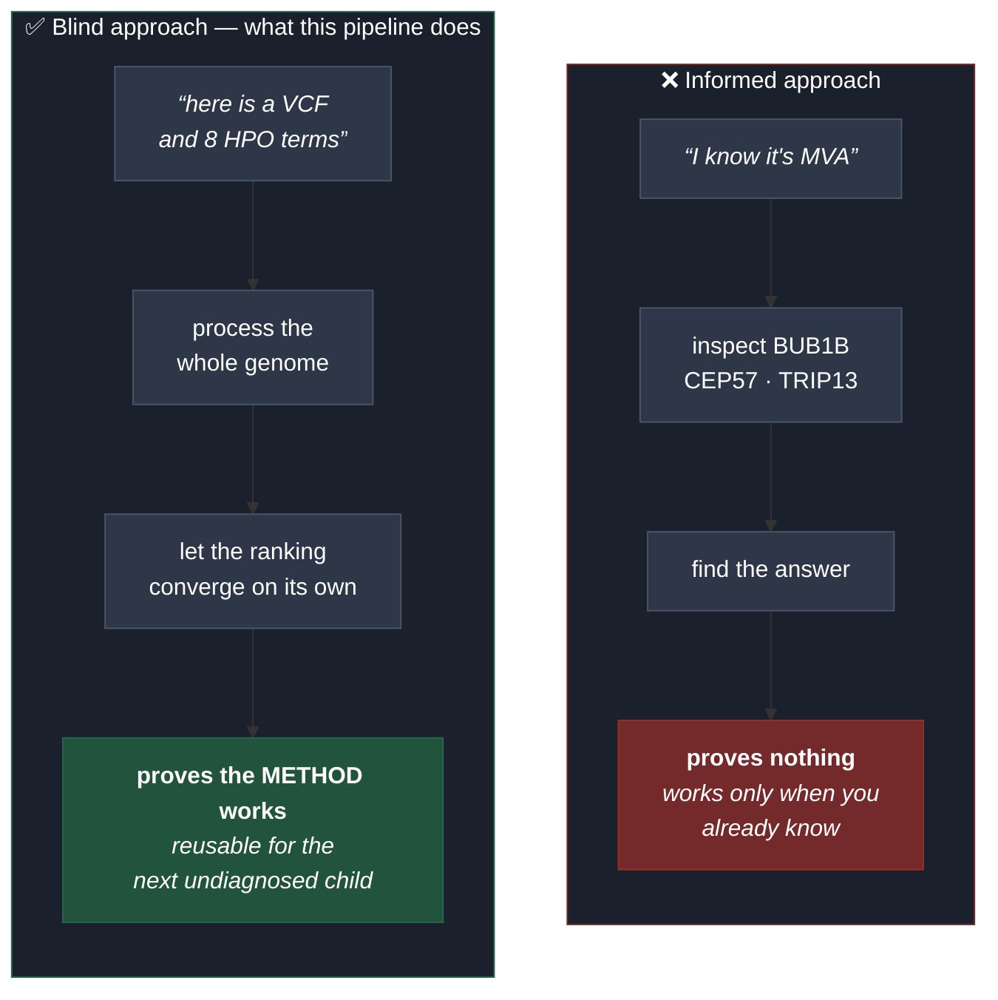

# Rare Disease, Real Kid — MVA Hackathon 2026

A **blind, genome-wide variant triage pipeline** for a real case of Mosaic
Variegated Aneuploidy (MVA). Track 1 — variant prediction.

* Challenge: <https://huggingface.co/spaces/SageBio/rare-disease-real-kid-mva-hackathon-2026>
* Dataset (gated): <https://huggingface.co/datasets/SageBio/mva-hackathon-2026-data>
* Submission window: 24 Aug 2026 – 24 Oct 2026 (23:59 UTC) · **max 6 submissions**
* Qualitative evaluation: 24 Oct – 24 Nov 2026

---

## The core design decision: a blind search

The hackathon is named after the disease, and the evaluator's public source code
states the answer key is a *compound-heterozygous* pair. Either fact alone
narrows the problem to three genes and one inheritance model.

**This pipeline deliberately ignores both.**



Stages 01–05 contain **no gene list, no disease name, no inheritance hint**. The
compound-heterozygous expectation is used **only** as a post-hoc validation gate
(stage 06), applied after the ranking is closed.

A method that only works when you already know the answer helps no future
patient — and reusability for other undiagnosed individuals is the stated goal
of this hackathon.

### Result

Starting from **5,012,204 variants**, the blind pipeline ranked **BUB1B first
among 140 candidate genes**, with a **22.8 % margin** over the runner-up and
**5/5 convergence criteria** met. An independent, hypothesis-driven analysis of
the three known MVA genes converged on the **same variant pair**.

---

## Architecture: why the data is not in this folder

Two separate filesystems, on purpose:

| | Location | Contents | Rationale |
|---|---|---|---|
| **Code** | this repository (NTFS) | scripts, docs, reports | version-controlled |
| **Data** | `~/mva/` in WSL (ext4) | VCF, intermediates, heavy outputs | 5–10× faster I/O than `/mnt/c` |

There is a second reason. If the VCF lived inside this repository, a careless
`git add .` would publish a child's genome. The file **not being here** is
defence in depth; `.gitignore` is the second line, not the first.

### Reaching the data from Windows

1. **`results/`** — lightweight reports are mirrored here by
   `pipeline/sync_results.sh`, so they open like any project file
2. **UNC path** — paste into Explorer or open as a folder in VS Code:

   ```
   \\wsl.localhost\Ubuntu-24.04\home\user\mva
   ```

   Pin it to Explorer's Quick Access once and it stays one click away. A `.lnk`
   shortcut is not used: `WScript.Shell` normalises `\\wsl.localhost\...` into a
   broken `C:\wsl.localhost\...` target, and a machine-specific shortcut does
   not belong in a shared repository anyway.

---

## Pipeline


**Blind stages: 01 → 05.** No gene list, no disease name, no inheritance hint.
Stage 06 applies the compound-heterozygous expectation **only after** the
ranking is final.

| Script | Purpose |
|---|---|
| `00_config.sh` | shared paths, thresholds, constants |
| `00b_extract_phenotype.py` | HPO terms from the confidential `.docx` (never committed) |
| `01_qc_baseline.sh` | characterise the raw VCF before filtering anything |
| `02a_download_snpeff_db.sh` | resumable snpEff database download |
| `02_annotate_genomewide.sh` | genome-wide functional annotation (blind) |
| `03_inheritance_models.py` | quality, VAF coherence, impact, inheritance model |
| `04_frequency_clinical.py` | gnomAD / ClinVar / CADD via Ensembl VEP REST |
| `04b_seed_cache.py` | recover annotations from a previous run after batch failures |
| `05_phenotype_rank.py` | HPO semantic-similarity ranking |
| `06_validate_convergence.py` | post-ranking validation gate |
| `07_secondary_findings.py` | ACMG SF v3.2 secondary-findings cross-check |
| `run_all.sh` · `status.sh` · `sync_results.sh` · `99_data_inventory.sh` | orchestration and auditing |

Full stage-by-stage rationale: [docs/01_pipeline_flow.md](docs/01_pipeline_flow.md)

---

## Running it

Scripts execute inside WSL. **Always use a login shell** (`bash -lc`): a
non-login shell does not read `/etc/profile`, so the `bio` environment is not on
`PATH` and everything fails with *command not found*.

```bash
# full pipeline
wsl -d Ubuntu-24.04 -- bash -lc \
  "bash /mnt/c/Users/user/Documents/real-kid-mva-hackathon/pipeline/run_all.sh"

# pipeline status
wsl -d Ubuntu-24.04 -- bash -lc \
  "bash /mnt/c/Users/user/Documents/real-kid-mva-hackathon/pipeline/status.sh --progress"
```

Every stage is **idempotent**: valid existing output is skipped.

**Anyone re-running this pipeline must supply their own authorised copy of the
dataset.** No patient data is included here by design — `00b` extracts the HPO
terms from the original confidential document, which each participant must
obtain through the gated Hugging Face dataset.

### Environment

WSL2 · Ubuntu 24.04 · micromamba environment `bio`:
bcftools / samtools / htslib 1.24 · bwa · minimap2 · whatshap · bedtools ·
seqkit · snpEff 5.4c (`GRCh38.115`) · nextflow · bbmap · Python 3.12 ·
OpenJDK 21.

Compute: local only, Intel i9-14900HX (24 c / 32 t), 32 GB RAM. No cloud cost.

---

## Engineering notes

Failures that shaped the pipeline, recorded because they are the reason certain
code exists:

| Failure | Consequence |
|---|---|
| snpEff exits **0** even when it fails (invalid option, dead download) | stage 02 validates output **size and variant count**, never the exit code |
| snpEff's downloader has no retry or timeout — it froze at 285/770 MB for 32 min | `02a` uses `curl -C -` with retry and a minimum-speed cutoff |
| 3 of 47 VEP batches returned HTTP 500, leaving 600 variants unannotated and silently treated as "rare" | stage 04 rewritten with an incremental cache and resume; `04b` recovers a previous run |
| `print(..., file=sys.stderr)` without `flush=True` never appears — Python block-buffers a pipe | all progress output flushes explicitly |
| **`GQ = 99` and `DP = 60` on 201 false variants in `SERPINA1`** | VAF-coherence filter added — see below |

### The `SERPINA1` artefact

The secondary-findings stage surfaced four distinct frameshifts within 61 bp —
impossible in a diploid genome. The locus carried **201 variants across ~14 kb**,
all heterozygous, with allele fractions of **0.13–0.20** instead of ~0.50.

*SERPINA1* sits at 14q32.13 beside the highly homologous pseudogene *SERPINA2*.
Reads from the paralogue mismap onto the real gene and are called as
low-fraction heterozygotes.

**A high `GQ` means the caller is confident, not that the variant is real.** The
filters tested caller confidence but never biological coherence. Adding a
VAF-coherence check (het 0.25–0.75, hom ≥ 0.85) removed **107,395 variants
genome-wide** — and *BUB1B* remained rank 1 with an **identical score**.

---

## Data governance

Patient data lives exclusively on ext4 inside WSL, never in this repository.
Three independent barriers:

1. **Physical separation** — the data is not in the repository folder at all
2. **`.gitignore`** — blocks `*.vcf*`, `*.bam`, `*.cram`, `*.fastq*`, `*.docx`,
   `patient_hpo.tsv`, and all prediction files
3. **Audit** — `99_data_inventory.sh` inventories every location holding data and
   classifies it as patient-derived or public resource

Only genomic coordinates (e.g. `15 40209701 T G`) were sent to public annotation
APIs — no subject identifier of any kind.

Verification before any push:

```bash
git ls-files | grep -E '\.(vcf|bam|cram|fastq|docx)$|patient_hpo'   # must return nothing
```

### Data deletion (mandatory)

All data must be deleted **within 30 days of hackathon close**, including
private repositories and any intermediate or derived datasets.

```bash
rm -rf ~/mva/data/raw ~/mva/work ~/mva/results
rm -rf results/
```

Then notify **both** official addresses — the Official Rules and the dataset
gating form list different ones:

* `RarediseaserealkidMVAhackathon2026@synapse.org`
* `MVAHackathon2026@synapse.org`

Full compliance checklist: [docs/02_compliance.md](docs/02_compliance.md)

---

## Submission format

Verified against the evaluator's own source (`tabs/submit_track1.py`,
`evaluation.py`, `groundtruth.py`):

```
proband_id,chrom_1,pos_1,ref_1,alt_1,chrom_2,pos_2,ref_2,alt_2,epcr,finding_type,notes
```

* `proband_id` **must be `PROBAND01`** — hardcoded in the submission handler
* `chrom` requires the **`chr` prefix** (`chr15`). The source VCF uses Ensembl
  naming (`15`), and **`evaluation.py` performs no normalisation**: it compares
  exact tuples `(chrom.strip(), int(pos), ref.upper(), alt.upper())`
* `epcr` in `(0, 1]`, rows sorted by EPCR descending, max 10 rows
* `finding_type`: `primary` or `secondary`

Prediction files and the methods report are **not committed** while the
competition is open — the challenge requires a public repository, and publishing
the causal coordinates early would hand the answer to other teams. The
repository demonstrates the **method**; the answer goes directly to the (private)
submission form. Both will be added after close. See
[submissions/README.md](submissions/README.md).

---

## Acknowledgement

Required verbatim in any resulting publication:

> This work was made possible through the Hackathon, organized by Sage
> Bionetworks in partnership with the MVA Society, Hugging Face, and BEACON
> (The Benchmarking, Evaluation, and Assessment Consortium for Science), with
> prize sponsorship from AWS and Anthropic. We are deeply grateful to the child
> and their family who generously contributed their data and their story to
> advance research into this rare disease. We acknowledge their trust in making
> this Hackathon possible.

Data shared under a protocol approved by **WCG IRB #20252010**.
Submissions released under **CC BY 4.0**.
