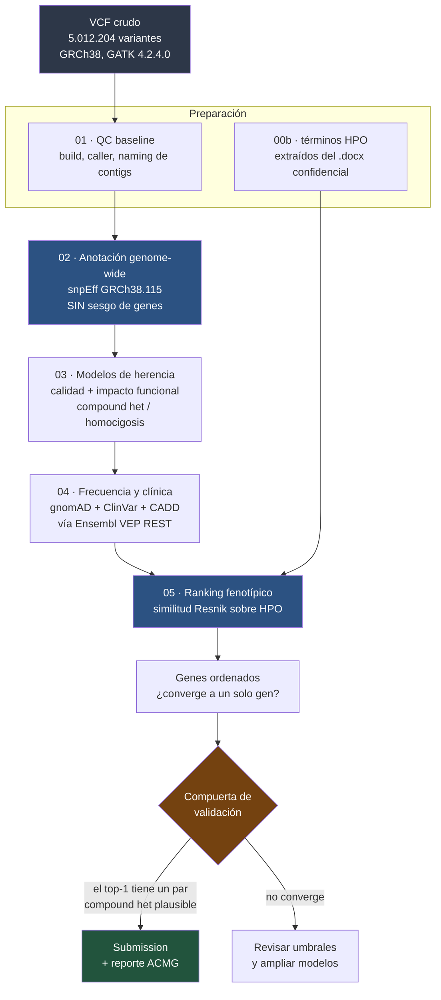

# Flujo del pipeline — qué hace cada etapa y por qué

Documento de referencia del pipeline de triage genómico para el
**MVA Hackathon 2026, Track 1**.

---

## 1. Qué problema resuelve

Un chico tiene una enfermedad ultra-rara. Tenemos su genoma completo secuenciado
(**5.012.204 variantes**) y ocho signos clínicos codificados en HPO. Hay que
encontrar las **dos variantes causales**.

Buscar a mano es imposible. El pipeline reduce esos 5 millones a un puñado de
candidatas ordenadas por probabilidad, con evidencia trazable para cada
descarte.

---

## 2. El principio rector: búsqueda **CIEGA**

El nombre del hackathon dice "MVA" y el evaluador filtró que la respuesta es un
par en heterocigosis compuesta. Con eso alcanzaría para mirar tres genes y
terminar en una tarde.

**No lo hacemos así, y ese es el punto.**

```
   Método sesgado                      Método ciego
   ─────────────                       ────────────
   "sé que es MVA"                     "acá hay un VCF y 8 términos HPO"
        ↓                                    ↓
   miro BUB1B/CEP57/TRIP13             proceso el genoma entero
        ↓                                    ↓
   encuentro la respuesta              el ranking converge solo
        ↓                                    ↓
   no demuestro nada                   demuestro que el MÉTODO funciona
```

El pipeline **no contiene** la palabra BUB1B, ni una lista de genes candidatos,
ni el nombre de la enfermedad. Entra el VCF crudo y salen genes ordenados.

La pista de heterocigosis compuesta se usa como **compuerta de validación**
al final, nunca como filtro de búsqueda.

---

## 3. Diagrama general



---

## 4. Las etapas, una por una

### `00_config.sh` — configuración compartida

No hace nada por sí solo: define rutas, umbrales y constantes que **todas** las
etapas importan. Un solo lugar donde cambiar `MIN_GQ` o el nombre de la base de
datos, en vez de doce.

También fija la separación de mundos:

| | Dónde | Por qué |
|---|---|---|
| Código | `C:\...\real-kid-mva-hackathon\` (NTFS) | versionable con git |
| Datos | `~/mva/` en WSL (ext4) | I/O 5-10× más rápido que `/mnt/c` |

---

### `00b_extract_phenotype.py` — los términos HPO del paciente

**Entrada:** `Challenge_Clinical_Phenotype_1.docx`
**Salida:** `~/mva/data/raw/patient_hpo.tsv` (8 términos)

El documento dice *"Confidential — Do not redistribute"*. Los términos HPO
**son** información clínica del chico, así que no pueden vivir en un repo
público. Este script los extrae del docx y los deja junto al resto de los datos
del paciente, donde el `.gitignore` los bloquea.

Consecuencia deliberada: quien clone el repo debe correr este paso con su
propia copia autorizada del dataset. Es lo correcto, y además mantiene el
pipeline reproducible sin filtrar nada.

---

### `01_qc_baseline.sh` — caracterizar antes de tocar

**Entrada:** VCF crudo · **Salida:** `results/01_qc_baseline.txt`

Establece los hechos **antes** de filtrar nada: build del genoma, caller y
versión, naming de contigs, campos `FORMAT` disponibles, filtros definidos y
conteos. Sin esto, ninguna decisión posterior es auditable.

Detecta automáticamente que el VCF usa naming Ensembl (`15`, no `chr15`) y
avisa que el submission necesita anteponer el prefijo. **Ese detalle vale 100
puntos o 0**, así que no puede depender de que alguien se acuerde.

---

### `02a_download_snpeff_db.sh` — descargador robusto

**Salida:** base de datos `GRCh38.115` (775 MB instalados)

Existe porque el descargador interno de snpEff **no tiene reintento ni
timeout**: si se cae el socket, el proceso Java queda dormido para siempre, sin
error y sin exit code distinto de cero. Nos pasó — se congeló a los 285 MB de
770 y estuvo 32 minutos al 0,5 % de CPU.

Reemplazo con `curl -C -` (reanuda), `--retry 10` y corte por velocidad mínima.
Los 484 MB restantes bajaron en 45 segundos.

---

### `02_annotate_genomewide.sh` — anotación funcional CIEGA

**Entrada:** 5.012.204 variantes · **Salida:** `work/02_annotated.vcf.gz`

Anota **todas** las variantes del genoma con su consecuencia funcional. Este es
el paso que hace ciega la búsqueda: no hay región objetivo, no hay panel de
genes, no hay lista de candidatos.

**Por qué `GRCh38.115` y no `GRCh38.mane.*`:** MANE cubre ~19.300 genes
codificantes con un transcrito cada uno — ideal para *reportar*, porque es el
estándar clínico que usa ClinVar. Pero en una búsqueda ciega prima la
**cobertura completa**. El reporte final sí usa transcritos MANE, vía VEP en la
etapa 04.

**Lección incorporada:** snpEff sale con código 0 aunque falle. La etapa valida
tamaño de salida y número de variantes, y aborta si no cuadra.

---

### `03_inheritance_models.py` — calidad, impacto y herencia

**Entrada:** VCF anotado · **Salida:** `work/03_candidates.tsv`

Tres filtros y una clasificación:

1. **Calidad** — `FILTER=PASS`, `GQ ≥ 20`, `DP ≥ 10`
2. **Impacto** — solo `HIGH` o `MODERATE` de snpEff
   (nonsense, frameshift, splice, missense)
3. **Genotipo** — descarta homocigotos de referencia y no-llamados
4. **Modelo de herencia**, agrupando por gen:
   - `AR_COMPOUND_HET` → gen con **≥ 2** variantes heterocigotas
   - `AR_HOMOZYGOUS` → gen con **≥ 1** variante homocigota alternativa

No se evalúa *de novo*: el paciente es **singleton**, no hay trío. Sin padres no
hay forma de establecer la fase por pedigrí, así que los pares se marcan como
**presuntos en trans** y se anota si GATK dejó phasing físico (`PID`/`PGT`) que
permita confirmarlos o descartarlos.

---

### `04_frequency_clinical.py` — frecuencia poblacional y evidencia clínica

**Entrada:** candidatas de 03 · **Salida:** `work/04_rare_candidates.tsv`

Principio: **una enfermedad que afecta a menos de 50 personas en el mundo no
puede estar causada por una variante frecuente**. Se consulta Ensembl VEP REST
en lotes de 200 variantes y se descarta todo lo que supere `AF ≥ 0.01` en
gnomAD.

Trae además, en la misma consulta: transcrito MANE, HGVSc/HGVSp, CADD, rsID y
clasificación de ClinVar.

**Por qué API y no bases locales:** para unos miles de variantes, VEP REST es
más rápido que descargar cachés de decenas de GB, y la anotación queda siempre
actualizada. La ausencia total de gnomAD se marca como evidencia **PM2** de
ACMG.

---

### `05_phenotype_rank.py` — ranking por similitud fenotípica

**Entrada:** candidatas raras + los 8 términos HPO
**Salida:** `results/05_ranked_genes.tsv`

No es un simple "¿el gen tiene este término?". Usa **similitud semántica de
Resnik** sobre la ontología HPO:

```
   IC(t)      = -log( genes anotados a t o sus descendientes / total )
                 ↑ un término raro pesa mucho más que uno genérico

   sim(a, b)  = máximo IC entre los ancestros comunes de a y b
                 ↑ "rabdomiosarcoma" y "neoplasia" se parecen,
                   pero mucho menos que dos sarcomas específicos

   score(gen) = MEDIA sobre los términos del paciente de
                max_b sim(término_paciente, b)
                 ↑ media y no suma: un gen con 300 anotaciones
                   no gana por acumulación
```

Es el principio detrás de Phenomizer y del priorizador de Exomiser, escrito de
forma **explícita y auditable** en vez de delegado a una caja negra.

---

### Utilidades

| Script | Para qué |
|---|---|
| `run_all.sh` | encadena `01 → 05`; cada etapa es idempotente |
| `status.sh` | qué etapa está lista y cuál falta |
| `sync_results.sh` | espeja reportes livianos (< 5 MB) al proyecto en Windows |
| `99_data_inventory.sh` | inventario de fuentes; cumplimiento del DUA |

---

## 5. El embudo

```
   5.012.204   variantes en el VCF
        ↓      FILTER = PASS
   4.740.790
        ↓      genotipo no-referencia + GQ≥20 + DP≥10
      ~?
        ↓      impacto HIGH o MODERATE
      ~?
        ↓      gen con ≥2 het  ó  ≥1 hom-alt
      ~?
        ↓      gnomAD AF < 0.01
      ~?
        ↓      ranking por similitud fenotípica HPO
     TOP 25
```

Los números intermedios se completan cuando corra el pipeline. Cada salto queda
registrado en `results/0X_*_summary.txt` — **ningún descarte es invisible**.

---

## 6. Gobernanza de datos

El Data Use Agreement obliga a borrar todos los datos al terminar y a
notificarlo por correo. Por eso:

| Categoría | Ubicación | Al terminar |
|---|---|---|
| Datos del paciente | `~/mva/data/raw`, `work`, `results` | **se borran** |
| Recursos públicos | entorno conda, BD snpEff, HPO | se conservan |
| Código | repo de git | se conserva |

```bash
rm -rf ~/mva/data/raw ~/mva/work ~/mva/results
# → notificar a MVAHackathon2026@synapse.org
```

Tres barreras para que el genoma del chico nunca llegue a GitHub:

1. El archivo **no está** en la carpeta del repo (vive en otro sistema de archivos)
2. `.gitignore` bloquea `*.vcf*`, `*.bam`, `*.cram`, `*.fastq*`, `*.docx`, `patient_hpo.tsv`
3. `99_data_inventory.sh` audita dónde está cada byte

---

## 7. Cómo ejecutarlo

```bash
# pipeline completo
wsl -d Ubuntu-24.04 -- bash -lc \
  "bash /mnt/c/Users/user/Documents/real-kid-mva-hackathon/pipeline/run_all.sh"

# solo ver el estado
wsl -d Ubuntu-24.04 -- bash -lc \
  "bash /mnt/c/Users/user/Documents/real-kid-mva-hackathon/pipeline/status.sh"
```

**Siempre con `bash -lc`.** Un shell no-login no lee `/etc/profile`, así que el
`PATH` del entorno `bio` no se carga y todo falla con *command not found*.

---

## 8. Limitaciones conocidas

Decirlas es parte del método, no una debilidad:

- **No hay trío.** Sin padres no se puede probar la fase por pedigrí. Los pares
  compound het son *presuntos en trans*.
- **Phasing físico limitado.** GATK deja `PID`/`PGT` solo dentro de una misma
  región de ensamblado (cientos de pares de bases). Dos variantes separadas por
  más de eso no se pueden fasear con lecturas cortas, ni siquiera volviendo a
  los FASTQ.
- **Solo variantes pequeñas.** El VCF contiene SNV e indels. **No hay CNV, ni
  variantes estructurales, ni expansiones de repeticiones.** Si la causa fuera
  una de esas, este pipeline no la ve.
- **Regiones no codificantes.** El filtro por impacto `HIGH`/`MODERATE` descarta
  variantes intrónicas profundas y reguladoras. Es un compromiso consciente
  entre sensibilidad y ruido.
- **Cobertura de anotación.** Un gen sin anotaciones HPO obtiene score 0 aunque
  sea el causal. Es la limitación intrínseca de cualquier priorización
  fenotípica.
