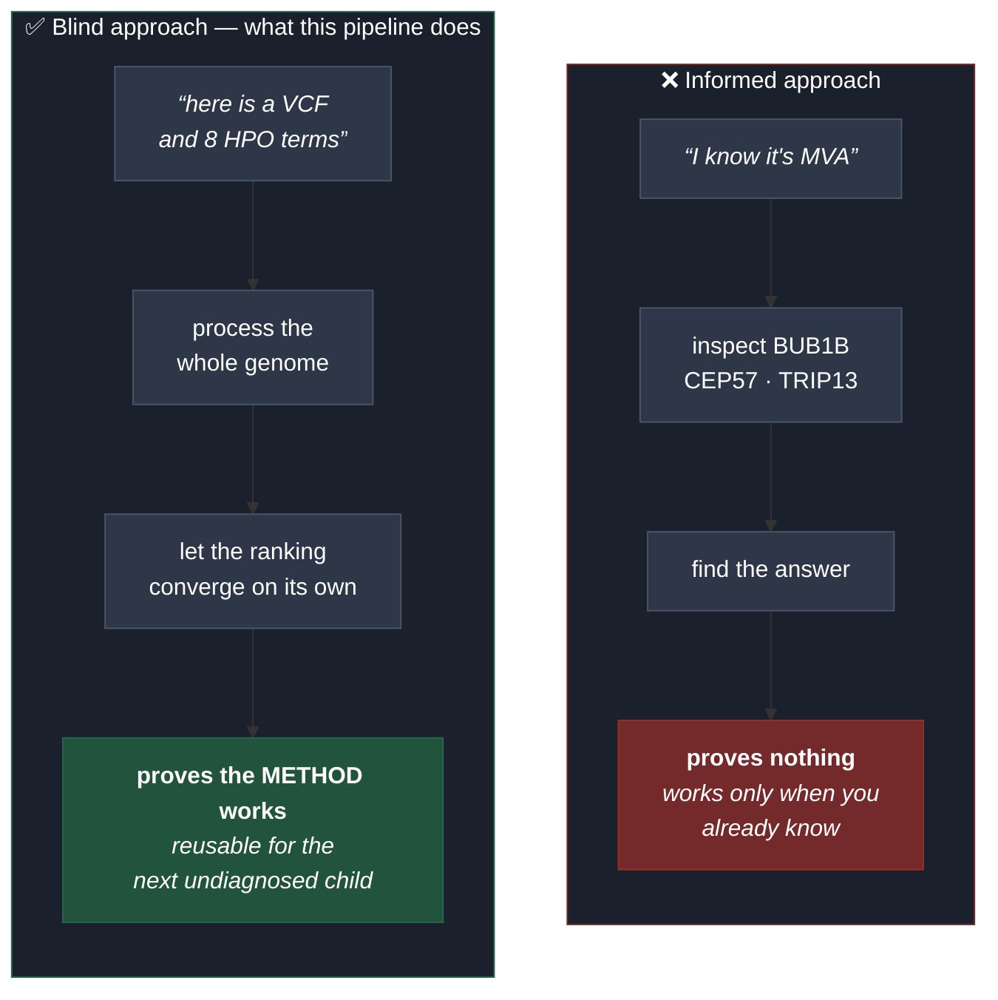
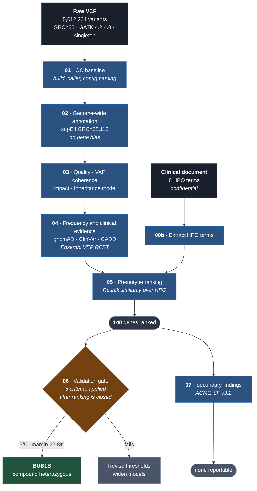
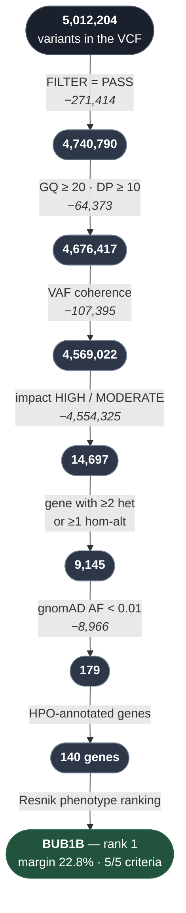

# Pipeline flow — what each stage does, and why

Reference document for the genomic triage pipeline built for the
**MVA Hackathon 2026, Track 1**.

---

## 1. The problem

A child has an ultra-rare disease. We have their whole genome sequenced
(**5,012,204 variants**) and eight clinical signs encoded as HPO terms. We need
to find the **two causal variants**.

Manual review is impossible. The pipeline reduces those five million to a short
ranked list, with traceable evidence for every discard.

---

## 2. The governing principle: a **BLIND** search

The hackathon is named after the disease, and the evaluator's public source code
states the answer key is a compound-heterozygous pair. Either fact alone reduces
the problem to three genes and an afternoon of work.

**We deliberately did not do that, and that is the point.**



The pipeline contains **no gene list, no disease name, and no inheritance
hint**. A raw VCF goes in; a ranked list of genes comes out.

The compound-heterozygous expectation is used as a **validation gate** at the
end — never as a search filter. If disease knowledge entered before the ranking,
the result would be circular and would prove nothing about the method.

---

## 3. Overview



---

## 4. The stages, one by one

### `00_config.sh` — shared configuration

Does nothing on its own: it defines the paths, thresholds and constants that
**every** stage imports. One place to change `MIN_GQ` or the annotation database
name, instead of twelve.

It also encodes the separation of worlds:

| | Location | Rationale |
|---|---|---|
| Code | repository (NTFS) | version-controlled |
| Data | `~/mva/` in WSL (ext4) | 5–10× faster I/O than `/mnt/c` |

---

### `00b_extract_phenotype.py` — the patient's HPO terms

**Input:** `Challenge_Clinical_Phenotype_1.docx`
**Output:** `~/mva/data/raw/patient_hpo.tsv` (8 terms)

The document is marked *"Confidential — Do not redistribute"*. The HPO terms
**are** the child's clinical information, so they cannot live in a public
repository. This script extracts them from the document and leaves them
alongside the rest of the patient data, where `.gitignore` blocks them.

A deliberate consequence: anyone cloning the repository must run this step with
their own authorised copy of the dataset. That is the correct behaviour, and it
keeps the pipeline reproducible without leaking anything.

---

### `01_qc_baseline.sh` — characterise before touching anything

**Input:** raw VCF · **Output:** `results/01_qc_baseline.txt`

Establishes the facts **before** any filtering: genome build, caller and
version, contig naming, available `FORMAT` fields, defined filters, and counts.
Without this, no downstream decision is auditable.

It automatically detects that the VCF uses Ensembl contig naming (`15`, not
`chr15`) and warns that the submission must prepend the prefix. **That detail is
worth 100 points or 0**, so it cannot depend on someone remembering it.

---

### `02a_download_snpeff_db.sh` — resumable downloader

**Output:** `GRCh38.115` database (775 MB installed)

This script exists because snpEff's built-in downloader has **no retry and no
timeout**: when the socket drops, the Java process sleeps forever — no error, no
non-zero exit code. It happened to us: frozen at 285 MB of 770, for 32 minutes,
at 0.5 % CPU.

Replaced with `curl -C -` (resume), `--retry 10`, and a minimum-speed cutoff.
The remaining 484 MB downloaded in 45 seconds.

---

### `02_annotate_genomewide.sh` — blind functional annotation

**Input:** 5,012,204 variants · **Output:** `work/02_annotated.vcf.gz`

Annotates **every** variant in the genome with its functional consequence. This
is the step that makes the search blind: no target regions, no gene panel, no
candidate list.

**Why `GRCh38.115` and not `GRCh38.mane.*`:** MANE covers ~19,300 protein-coding
genes with a single transcript each — ideal for *reporting*, since it is the
clinical standard ClinVar uses. But a blind search prioritises **complete
coverage**. The final report does use MANE transcripts, via VEP in stage 04.

**Lesson embedded:** snpEff exits 0 even when it fails. The stage validates
output size and variant count, and aborts if they do not match.

---

### `03_inheritance_models.py` — quality, coherence, impact, inheritance

**Input:** annotated VCF · **Output:** `work/03_candidates.tsv`

Four filters and a classification:

1. **Quality** — `FILTER=PASS`, `GQ ≥ 20`, `DP ≥ 10`
2. **Genotype/VAF coherence** — heterozygous `0.25 ≤ VAF ≤ 0.75`,
   homozygous `VAF ≥ 0.85` (see §5)
3. **Impact** — only snpEff `HIGH` or `MODERATE`
   (nonsense, frameshift, splice, missense)
4. **Genotype** — discards homozygous-reference and no-calls
5. **Inheritance model**, grouped by gene:
   - `AR_COMPOUND_HET` → gene with **≥ 2** heterozygous variants
   - `AR_HOMOZYGOUS` → gene with **≥ 1** homozygous-alternate variant

*De novo* models are **not** evaluated: the patient is a **singleton**, with no
trio. Without parents there is no way to establish phase from pedigree, so pairs
are flagged as **presumed in trans**, and the script records whether GATK left
physical phasing (`PID`/`PGT`) that could confirm or exclude them.

---

### `04_frequency_clinical.py` — population frequency and clinical evidence

**Input:** candidates from 03 · **Output:** `work/04_rare_candidates.tsv`

The governing principle: **a disease affecting fewer than 50 people worldwide
cannot be caused by a common variant.** A 1 % allele frequency implies roughly
80 million carriers. Variants with gnomAD `AF ≥ 0.01` are removed.

The same query also returns the MANE transcript, HGVSc/HGVSp, CADD, rsID and
ClinVar classification.

**Why an API rather than local databases:** for a few thousand variants, VEP
REST is faster than downloading tens of gigabytes of cache, keeps annotation
current, and leaves no additional data at rest. Complete absence from gnomAD is
recorded as ACMG **PM2** evidence.

**Resumability.** The first version wrote results only at the end: fifteen
minutes of silence, and a network failure meant starting from zero. It now
persists each batch to an incremental cache and skips what is already annotated.
`04b_seed_cache.py` recovers a previous run — when 3 of 47 batches returned
HTTP 500, it re-fetched only the missing 600 variants instead of repeating forty
minutes of valid queries.

---

### `05_phenotype_rank.py` — phenotype similarity ranking

**Input:** rare candidates + the 8 HPO terms
**Output:** `results/05_ranked_genes.tsv`

Not a simple "does this gene have this term?". It uses **Resnik semantic
similarity** over the HPO ontology:

```
   IC(t)      = −log( genes annotated to t or its descendants / total genes )
                 ↑ a rare term carries far more weight than a generic one

   sim(a, b)  = max IC over the common ancestors of a and b
                 ↑ "rhabdomyosarcoma" and "neoplasm" are related,
                   but far less than two specific sarcomas

   score(gene)= MEAN over the patient's terms of
                max_b sim(patient_term, b)
                 ↑ mean, not sum: a gene with 300 annotations
                   does not win by accumulation
```

This is the principle behind Phenomizer and the Exomiser prioritiser, written
**explicitly and auditably** rather than delegated to a black box.

The effect is visible in the results: *ZFP57* matched all 8 HPO terms while
*BUB1B* matched 7, yet *BUB1B* ranks higher — information content rewards
**specificity, not count**.

---

### `06_validate_convergence.py` — the validation gate

**Input:** ranking + rare candidates · **Output:** `results/06_convergence_report.txt`

Stages 01–05 run without knowing the disease. This is the only stage that
applies external knowledge, and it does so **after** the ranking is closed:

| Criterion | Threshold |
|---|---|
| Margin over the runner-up | ≥ 15 % |
| Inheritance model | `AR_COMPOUND_HET` or `AR_HOMOZYGOUS` |
| Rare variants retained | ≥ 2 |
| High-severity variants | ≥ 1 `HIGH` |
| Independent evidence | ClinVar pathogenic, or CADD ≥ 20 |

Failing any criterion does not invalidate the finding, but must be declared in
the methods report.

---

### `07_secondary_findings.py` — secondary findings

**Input:** rare candidates · **Output:** `results/07_secondary_findings.txt`

The challenge FAQ states that secondary findings do not affect the automated
score and are set aside for qualitative review by the judging panel.

Independently of the competition, reporting actionable secondary findings is
standard clinical practice: if a pathogenic variant appears in a gene with an
available medical intervention, it should be flagged even when it does not
explain the presenting phenotype.

Cross-checks the rare candidates against the **ACMG SF v3.2** list (Miller et
al., *Genet Med* 2023) and against a self-curated treatable-disease list,
declared as such and never presented as consensus.

**This is not a clinical report.** It is a list of candidates for human review.
A reportable secondary finding requires orthogonal confirmation, full ACMG
classification, and genetic counselling.

---

### Utilities

| Script | Purpose |
|---|---|
| `run_all.sh` | chains `01 → 07`; every stage idempotent |
| `status.sh` | which stage is complete, which is pending (`--progress` counts variants) |
| `sync_results.sh` | mirrors lightweight reports (< 5 MB) to the project folder |
| `99_data_inventory.sh` | inventory of every data location — DUA compliance |

---

## 5. Quality-control finding: paralogue mismapping

The secondary-findings stage surfaced **four distinct frameshift variants in
*SERPINA1* within 61 bp**. Biologically impossible: a diploid genome has two
alleles, not four.

Inspection of the locus:

| Signal | Observed | Expected for a real het |
|---|---|---|
| Variants in the gene | **201** across ~14 kb | 20–40 |
| Genotype | all `0/1` | a mix of het and hom |
| Allele fraction | **0.13 – 0.20** | ~0.50 |
| Spacing | one every 2–10 bp | dispersed |
| `GQ` / `DP` | 99 / 50–60 | the same |

*SERPINA1* lies in the SERPINA cluster at 14q32.13, adjacent to the highly
homologous pseudogene *SERPINA2*. Reads originating from the paralogue mismap
onto the real gene and are called as low-fraction heterozygotes.

**The lesson:** a high `GQ` means the *caller* is confident — not that the
*variant is real*. Our filters tested caller confidence but never biological
coherence.

**The fix:** a VAF-coherence filter (het 0.25–0.75, hom ≥ 0.85), which removed
**107,395 variants genome-wide**.

**The robustness check:** after this substantially stricter filter, *BUB1B*
remained rank 1 with an **identical score (1.8476)** and 5/5 convergence
criteria. The finding never depended on tolerating noise.

---

## 6. The reduction funnel



Every step is recorded in `results/0X_*_summary.txt`. **No discard is silent.**

---

## 7. Data governance

The Data Use Agreement requires deleting all data within 30 days of hackathon
close — including **private repositories and any intermediate or derived
datasets** — and notifying the organisers.

| Category | Location | At close |
|---|---|---|
| Patient data | `~/mva/data/raw`, `work`, `results` | **deleted** |
| Public resources | conda environment, snpEff DB, HPO | retained |
| Code | git repository | retained |

```bash
rm -rf ~/mva/data/raw ~/mva/work ~/mva/results
rm -rf results/
```

Then notify **both** official addresses — the Official Rules and the dataset
gating form list different ones:
`RarediseaserealkidMVAhackathon2026@synapse.org` and
`MVAHackathon2026@synapse.org`.

Three barriers keep the child's genome out of GitHub:

1. The file **is not** in the repository folder — it lives on another filesystem
2. `.gitignore` blocks `*.vcf*`, `*.bam`, `*.cram`, `*.fastq*`, `*.docx`,
   `patient_hpo.tsv`, and all prediction files
3. `99_data_inventory.sh` audits where every byte lives

Only genomic coordinates were sent to public annotation APIs — no subject
identifier of any kind.

---

## 8. Running it

```bash
# full pipeline
wsl -d Ubuntu-24.04 -- bash -lc \
  "bash /mnt/c/Users/user/Documents/real-kid-mva-hackathon/pipeline/run_all.sh"

# status only
wsl -d Ubuntu-24.04 -- bash -lc \
  "bash /mnt/c/Users/user/Documents/real-kid-mva-hackathon/pipeline/status.sh"
```

**Always use `bash -lc`.** A non-login shell does not read `/etc/profile`, so the
`bio` environment is not on `PATH` and every command fails with *command not
found*.

---

## 9. Known limitations

Stating them is part of the method, not a weakness:

- **No trio.** Without parents, phase cannot be proven from pedigree. Compound
  heterozygous pairs are *presumed in trans*.
- **Limited physical phasing.** GATK emits `PID`/`PGT` only within a single
  assembly region (hundreds of base pairs). The two *BUB1B* variants are
  **10,911 bp apart** — beyond the reach of short-read phasing even if the FASTQ
  files were reprocessed.
- **Small variants only.** The VCF contains SNVs and indels. **No CNVs,
  structural variants, or repeat expansions.** If the cause were one of those,
  this pipeline would not see it.
- **Coding-biased.** The HIGH/MODERATE impact filter discards deep intronic and
  regulatory variants — a deliberate sensitivity/noise trade-off.
- **Annotation coverage.** A gene with no HPO annotations scores 0 even if
  causal. This is intrinsic to any phenotype-driven prioritisation.
